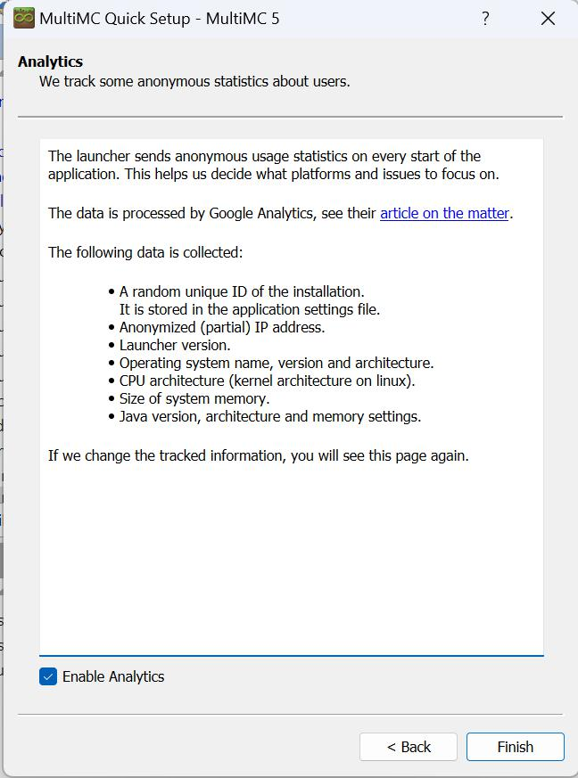
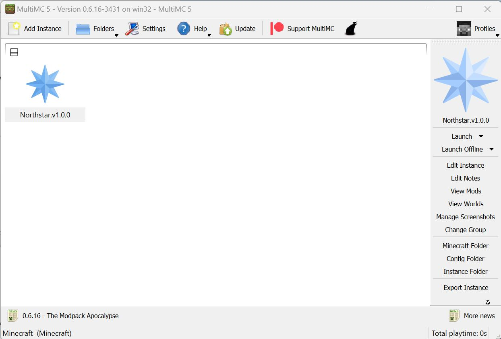

# Northstar Modpack

## About

Northstar Modpack is a group of mods for Minecraft focused on performance, quality of life enhancements, and light tech.

## Installation

The Northstar Modpack is managed and ran through MultiMC. You can download MultiMC [here](https://multimc.org/#Download).

Extract the download to an easy to access location, as you'll need to launch it every time you want to play the modpack.

Once launched, MultiMC will ask you to choose a language

Then ask you to choose a java version and set how much memory to allocate. We want to allocate at least 4096MiB of memory for this modpack.

If your system does not have any options here which are Version 17 or above, you will need to install a new version of java. You can download java [here](https://download.oracle.com/java/19/latest/jdk-19_windows-x64_bin.exe).

You can keep MultiMC open while you do this.

Once java is installed, click the Refresh button at the bottom left of the window. You should now see the newly installed java in the list.

Finally, MultiMC will ask about analytics.

Once you've finished these steps, you should land on the main screen for MultiMC.

Now you can download the modpack. Go to the [Releases](https://github.com/StopwatchString/Northstar-Modpack/releases) page and find the latest release. From there, download the zip file for the latest version of the modpack.

Now that you have the modpack, we just have to import it into MultiMC.

You can do this by clicking on the 'Add Instance' button at the top left of MultiMC, then selecting 'Import from zip'

Then use the 'Browse' button on the right to select the downloaded modpack, and hit OK!

If you've done everything right, MultiMC should extract the modpack and you should see something like this in MultiMC

On your first launch, MultiMC will require you to link your Microsoft account in order to play.

Go ahead and link your account as the final step.

You're now ready to play! Double click the launcher icon or use 'Launch' on the right to start the game.

Whenever you want to play the game from now on, you can just launch MultiMC and use the same launcher.